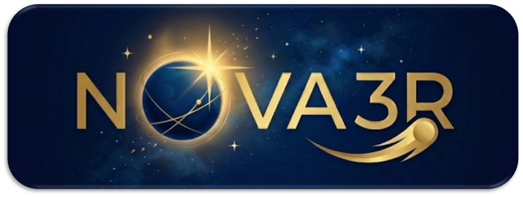

<p align="center">
  
</p>

<p align="center">
  <a href="https://arxiv.org/abs/2603.04179"></a>
  <a href="https://wrchen530.github.io/nova3r/"></a>
  <a href="https://www.apache.org/licenses/LICENSE-2.0"></a>
</p>

# PSUVPSC3DD / NOVA3R integrated research repo

This repo is the **merged working tree** for two parallel attempts:

1. the original `PSUVPSC3DD_repo` branch centered on `experiments/probe3d/`
2. the separate `probe` research fork that added proposal docs, configs, probe modules, and launch scaffolding

The result is a single NOVA3R-based repo where:

- the structured probe workspace lives in `docs/probe/`, `configs/probe/`, `nova3r/probe/`, and `scripts/probe/`
- the collaborator-side probing code remains in `experiments/probe3d/`
- the external VGGT dependency is now vendored under `third_party/vggt/`

## Upstream base

The codebase still builds on [NOVA3R](https://github.com/wrchen530/nova3r):

> **NOVA3R: Non-pixel-aligned Visual Transformer for Amodal 3D Reconstruction**  
> Weirong Chen, Chuanxia Zheng, Ganlin Zhang, Andrea Vedaldi, Daniel Cremers  
> ICLR 2026

## Repo layout

- `PROJECT.md` — project memory, decisions, current status
- `PROPOSAL.md` — proposal copy for the shared complete-3D decoding direction
- `docs/probe/` — notes, mappings, experiment plan, TODOs
- `docs/probe/workspace.md` — integrated workspace map and dependency layout
- `configs/probe/` — configs for canonical decoder / adapter / baseline / sweeps
- `nova3r/probe/` — reusable probe modules
- `scripts/probe/` — planning, sanity-run, sweep, eval, and visualization scripts
- `experiments/probe3d/` — collaborator-side concrete probe experiments and adapters
- `third_party/vggt/` — vendored VGGT repo used by both probe paths
- `dust3r/datasets/` — vendored dataset loaders formerly pulled from CUT3R at runtime
- `datasets_preprocess/` — vendored preprocessing helpers, including ScanNet scripts

## Quick start

```bash
cd /home/jcd/PSUVPSC3DD_repo

# create / update the shared conda env
make probe-env

# verify critical imports and CUDA
make probe-env-verify
```

For the structured VGGT -> NOVA3R sanity path:

```bash
python scripts/probe/run_vggt_to_nova3r_decoder.py
```

For the collaborator-side probe experiments, see:

```bash
cat experiments/probe3d/README.md
```

## Notes on the merge

- Paths that previously pointed to sibling repos now resolve inside this repo.
- `scripts/probe/visualize_run.py` is now supported by the integrated `demo/visualization/render_points.py` helpers.
- VGGT is expected at `third_party/vggt/`; local weights can still be provided explicitly.
- Some dataset preparation flows still assume existing local datasets / preprocessing assets and are documented as such.

## License

This project is licensed under the Apache License 2.0. Third-party code keeps its original license terms, including vendored code under `third_party/vggt/`.
